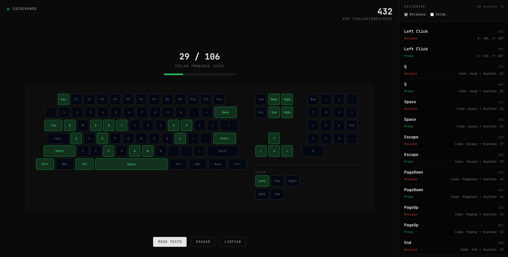

# kit

Keyboard Input Tester. Herramienta de diagnóstico de entradas de teclado y ratón. Todo en el navegador, sin backend.

Abre `index.html` en el navegador. Esa es toda la instalación.

## Qué hace

- Última tecla o botón pulsado, en grande, con su `code` y su `keyCode`
- KPM en tiempo real, en una ventana de 5 segundos
- Caja de texto que acumula lo escrito, con Backspace y Enter
- Historial de los últimos 50 eventos con marca de tiempo en ms, filtrable por releases y holds
- Modo Teclado: mapa visual completo — QWERTY, bloque de navegación, numpad y ratón — con seguimiento de las teclas ya probadas y porcentaje de cobertura
- Pausar, limpiar y alternar entre modo texto y modo teclado
- Aviso cuando la ventana pierde el foco
- Sin menú contextual, para poder probar el clic derecho

## Stack

HTML5 y JavaScript vanilla, con Tailwind Play CDN y Google Fonts. Un solo archivo, sin build y sin dependencias locales.

## Origen

Port de `014 minimal input tester` (Next.js + React + Tailwind v4), reescrito como archivo único para eliminar `node_modules` y dejarlo portable.

## License

GPL-3.0. See `LICENSE`.

## Credits

Desarrollado por [@memoriainfinita](https://github.com/memoriainfinita) con la asistencia de Claude (Anthropic).
